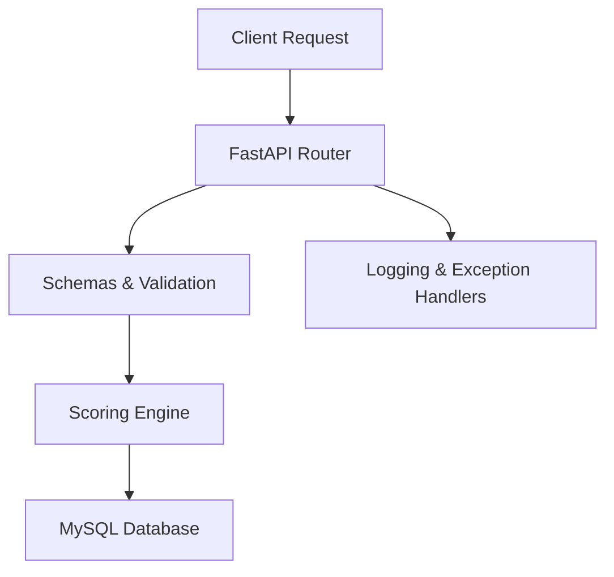

# Customer Risk Scoring API — FastAPI + MySQL Backend


## Overview

Backend system to mimic risk analytics & customer onboarding:
- Accepts customer data
- Computes rule-based risk score
- Stores everything in MySQL
- Built with production patterns (logging, error handling, validation)

### Introduction
Customer Risk Scoring API is a production-style backend that demonstrates customer onboarding with an explainable, rule-based risk engine. It features modular architecture, SQLAlchemy ORM models, Pydantic validation, centralized logging and error handling, and complete Docker + CI/CD readiness — ideal for showcasing in a professional portfolio or resume.

## Folder Structure

```
risk_api/
 ┣ app/
 ┃ ┣ core/
 ┃ ┃ ┗ scoring_engine.py
 ┃ ┣ schemas/
 ┃ ┃ ┣ __init__.py
 ┃ ┃ ┣ customer_schema.py
 ┃ ┃ ┗ risk_schema.py
 ┃ ┣ config/
 ┃ ┃ ┣ __init__.py
 ┃ ┃ ┣ database.py
 ┃ ┃ ┗ models_base.py
 ┃ ┣ routes/
 ┃ ┃ ┣ __init__.py
 ┃ ┃ ┣ customer_routes.py
 ┃ ┃ ┗ risk_routes.py
 ┃ ┣ utils/
 ┃ ┃ ┣ __init__.py
 ┃ ┃ ┗ logger.py
 ┃ ┣ exceptions/
 ┃ ┃ ┣ __init__.py
 ┃ ┃ ┗ handlers.py
 ┃ ┣ __init__.py
 ┃ ┗ main.py
 ┣ tests/
 ┃ ┣ __init__.py
 ┃ ┣ test_scoring_engine.py
 ┃ ┣ test_customer_routes.py
 ┃ ┣ test_risk_routes.py
 ┃ ┗ CustomerRiskScoringAPI.postman_collection.json
 ┣ requirements.txt
 ┣ README.md
 ┗ .env.example
```

## Tech Stack

- Python
- FastAPI
- MySQL + SQLAlchemy
- Pydantic
- Uvicorn
- PyTest
- Logging & middleware

## How to Run

1) Install dependencies:
```
pip install -r requirements.txt
```
2) Start the API:
```
uvicorn app.main:app --reload
```
3) Health check:
```
GET http://127.0.0.1:8000/health
```

## Environment Variables (.env)

```
DB_HOST=localhost
DB_USER=root
DB_PASSWORD=yourpassword
DB_NAME=risk_db
```

## API Endpoints

- POST `/customer/add`
  - Request:
    ```
    {
      "name": "Rahul",
      "age": 28,
      "income": 45000,
      "activity_score": 62
    }
    ```
  - Response (example):
    ```
    {
      "id": 1,
      "name": "Rahul",
      "age": 28,
      "income": 45000.0,
      "activity_score": 62,
      "created_at": "2025-12-12T10:00:00Z"
    }
    ```

- GET `/customer/{id}`
  - Response (example):
    ```
    {
      "id": 1,
      "name": "Rahul",
      "age": 28,
      "income": 45000.0,
      "activity_score": 62,
      "created_at": "2025-12-12T10:00:00Z"
    }
    ```

- POST `/risk/score`
  - Request:
    ```
    {
      "customer_id": 1,
      "age": 28,
      "income": 45000,
      "activity_score": 62
    }
    ```
  - Response (example):
    ```
    {
      "id": 1,
      "customer_id": 1,
      "final_score": 32,
      "explanation": "Age contributed 10 points (moderate risk). Income added 15 points (low income). Activity score added 7 points (high activity). Final score = 32.",
      "created_at": "2025-12-12T10:00:05Z"
    }
    ```

- GET `/risk/{customer_id}`
  - Response (example):
    ```
    [
      {
        "id": 1,
        "customer_id": 1,
        "final_score": 40,
        "explanation": "Age contributed 10 points (moderate risk). Income added 15 points (low income). Activity score added 15 points (moderate activity). Final score = 40.",
        "created_at": "2025-12-12T10:02:00Z"
      }
    ]
    ```

## Risk Scoring Logic Summary

- Age-based buckets:
  - `<25 → +20`, `25–40 → +10`, `40–60 → +5`, `≥60 → +15`
- Income buckets:
  - `<20,000 → +25`, `20,000–50,000 → +15`, `50,000–100,000 → +5`, `≥100,000 → +2`
- Activity score buckets:
  - `<30 → +30`, `30–60 → +15`, `60–80 → +5`, `≥80 → +2`
- Weighted sum: `final_score = age_points + income_points + activity_points`
- Explanation: human-readable breakdown of contributions

## Architecture Diagram

ASCII:
```
Client → FastAPI Routes → Schemas → Logic Engine → Database (MySQL)
                          ↓
                      Logging + Errors
```

Mermaid:


## Deployment Notes

- Use `uvicorn` for local, `gunicorn` with `uvicorn.workers.UvicornWorker` for production
- Enable SQLAlchemy `pool_pre_ping=True` and appropriate pool sizing
- Migrations via Alembic (future improvement)
- Ensure environment variables are set securely

### Run with Docker
```
docker build -t risk-api .
docker run -p 8000:8000 --env-file .env risk-api
```

### Run with Compose
```
docker-compose up --build
```
Note: when using Compose, set `DB_HOST=mysql` in `.env`.

### CI/CD Summary
- Automatic test execution (`pytest`)
- Linting (`flake8`)
- Docker image build after tests succeed
- Optional deployment to your preferred platform

## Contributing
See `CONTRIBUTING.md` for branch naming, commit style, and PR process.

## License
This project is licensed under the MIT License — see `LICENSE`.

## Author / Contact
Rahul — Feel free to reach out via GitHub Issues or your preferred contact channel.

## Testing Documentation

- Run tests:
```
pytest -q
```
- Test files:
  - `tests/test_scoring_engine.py`: unit tests for scoring rules
  - `tests/test_customer_routes.py`: API tests for customer endpoints
  - `tests/test_risk_routes.py`: API tests for risk endpoints
- Postman:
  - Import `tests/CustomerRiskScoringAPI.postman_collection.json`
  - Set `baseUrl` variable to `http://127.0.0.1:8000`

## Optimization Suggestions

- Caching for score calculations (e.g., simple LRU or memoization)
- Async DB support with `async SQLAlchemy`/`databases` library
- Externalize rule weights into a config file for easy tuning
- Dockerize the app for consistent deployment environments
